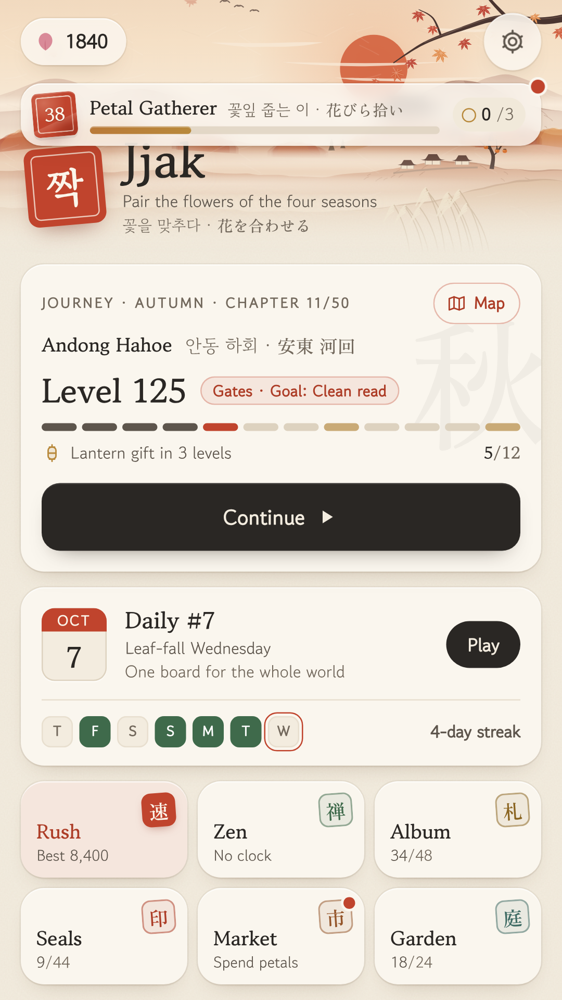
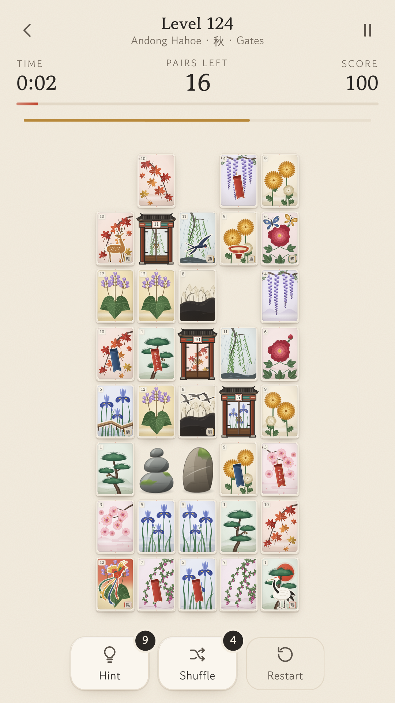
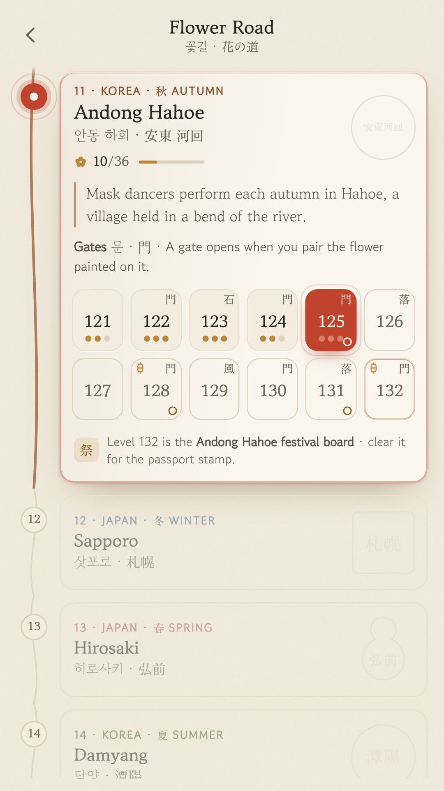
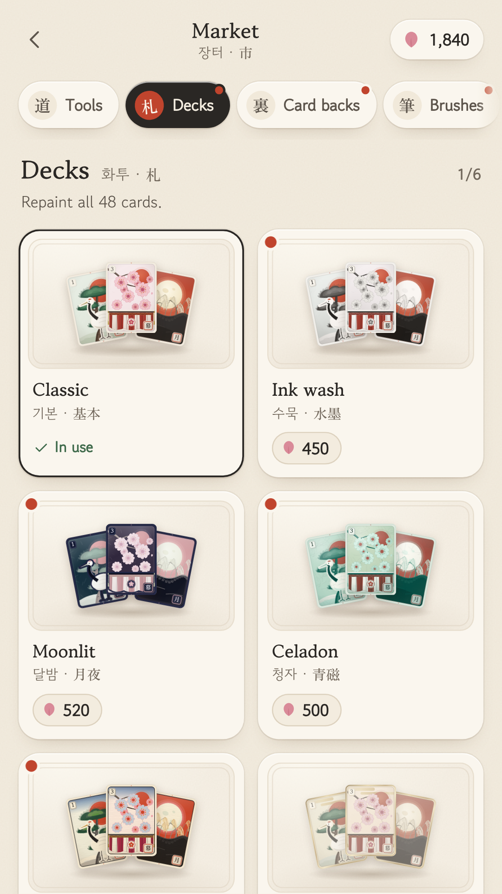
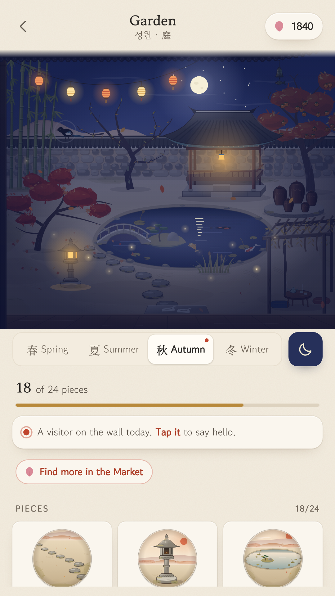
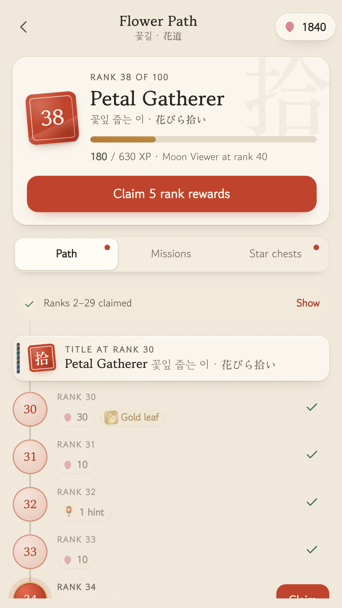
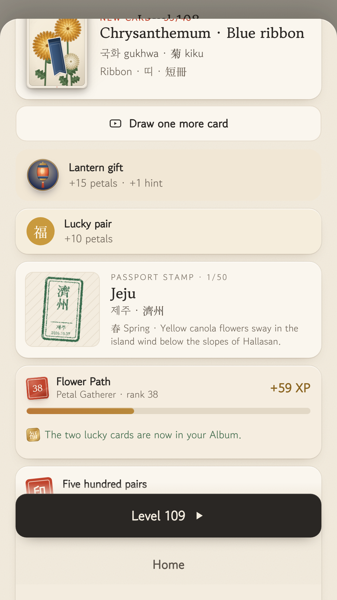
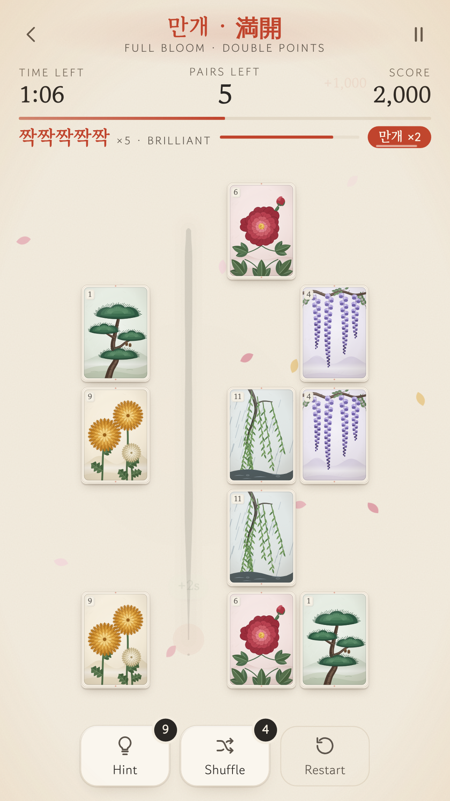

<p align="center"></p>

# Jjak (짝)

**A calm pair-connecting puzzle built on the 48-card flower deck Korea (Hwatu 화투) and
Japan (Hanafuda 花札) share.** Match flowers, chain combos (짝짝짝), clear the seasons,
and collect every card with its Korean and Japanese name.


| Home | Gates | Flower Road | Market |
|---|---|---|---|
|  |  |  |  |

| Garden at night | Flower Path | Passport stamp | Fever (×5 combo) |
|---|---|---|---|
|  |  |  |  |

## What's inside

| | |
|---|---|
| **Modes** | Journey: **the Flower Road**, 600 levels across 50 real places in Korea and Japan (and a road that goes on for players who finish it). Rush (60 s score attack), Daily Jjak (same board worldwide, weekday themes, streak, share), Zen (untimed) |
| **Level Director** | Every Journey board is built by a system, not by hand: an authored level grammar, bot personas that measure each board's difficulty, solver-proven validators, and an offline bank of 600 levels × 5 skill tiers. On the phone a player model picks the tier from how you play (time, first taps, misreads, hints, quits), with relief and stretch boards. Past 600, levels are generated live for each player in a Web Worker. All on device |
| **Mechanics** | Stones, Falling leaves, First snow, Lucky cards, Knots (매듭), Wind, Gates (門) and Fences (울타리), introduced one at a time with an animated demo, then mixed. Level goals (Rhythm, Clean read, Full bloom, Straight brush) on some boards. Festival boards end every chapter |
| **Onboarding** | Show, don't tell: an animated first minute (pair, bends, a blocked path, a combo) and a short demo on a mini board for every new idea, then a "your turn" |
| **Progression** | Flower Path (100 free ranks with exclusives), 3 daily missions + weekly chest, star chests, passport stamps, 40+ Seals (incl. real Go-Stop / Koi-Koi card sets), Album of 48 cards + 2 lucky cards + gold-leaf editions |
| **Market & Garden** | Petal shop: 5 deck styles, 5 card backs, path brushes, match effects, board papers, generative music styles, tools, Warm tea (streak freeze). A seasonal courtyard with 24 pieces, day/night and daily visitors |
| **Meta** | Generative seasonal music, opt-in Daily reminders, Fever at ×5 combo, 7-day gift calendar, lantern gifts every 4 levels, lifetime stats. ≈ 50 hours of launch content (see `docs/EXPANSION_PLAN.md`) |
| **Engine** | Shisen-sho path rule (≤ 2 turns, edge routing), boards that are **solvable by construction** (gate- and fence-aware), a solver that proves clears through the real rules, deterministic seeds, auto-reshuffle on dead ends |
| **Light & dark** | Paper and Ink themes, Auto follows the phone natively (DayNight Android theme, theme-aware splash and system bars, themed monochrome icon); `scripts/theme-parity.mjs` checks every screen renders the same whichever way the theme is chosen |
| **Monetization** | See [`docs/MONETIZATION.md`](docs/MONETIZATION.md). Rewarded-first ads, smart interstitials (cooldown after rewarded, "short break" notice), menu-only banners, a one-time Remove ads purchase, petal pouches (consumable) and a Supporter pack (Google Play Billing). No timers, fake discounts or loot boxes. |
| **Ads (detail)** | AdMob rewarded / interstitial / banner under a fair-ads policy, Google UMP consent, ads capped at PG content (13+ audience) |
| **Tech** | TypeScript + Vite (no UI framework) + Capacitor 8 (Android target SDK 36, min SDK 24) |
| **Art & sound** | Original SVG cards drawn in code, OFL fonts subset to the glyphs used, WebAudio-synthesized sound |

## Docs

* [`docs/RESEARCH.md`](docs/RESEARCH.md): the 2026 puzzle market, what players like and hate, and why this concept
* [`docs/GAME_DESIGN.md`](docs/GAME_DESIGN.md): loops, level curve, economy, ad rules, art direction
* [`docs/EXPANSION_PLAN.md`](docs/EXPANSION_PLAN.md): the launch expansion, the 50-hour content budget, the economy simulation, and Part C: the Level Director, new mechanics, show-don't-tell intros and the endless road (with research sources)
* [`docs/level-audit.md`](docs/level-audit.md): the measured difficulty curve of all 600 levels per tier
* [`docs/MONETIZATION.md`](docs/MONETIZATION.md): ad placements, frequency rules, remove-ads purchase, KPIs and A/B tests
* [`docs/PLAY_STORE_RELEASE.md`](docs/PLAY_STORE_RELEASE.md): **step-by-step publishing checklist** (AdMob IDs, signing, Play Console answers, listing copy)
* [`docs/CLAUDE_BUILD_PROMPT.md`](docs/CLAUDE_BUILD_PROMPT.md): the prompt for Claude to plan, rebuild, or extend the game
* [`docs/privacy-policy.html`](docs/privacy-policy.html): privacy policy ready for GitHub Pages

## Develop

```bash
npm install
npm run dev          # http://localhost:5173 — plays in any browser (ads are stubbed)
npm test             # engine, mechanics and solver tests, the Level Director (bank validation, persona simulations,
                     # endless fuzz), demo scripts, Flower Path, Market, Garden and the economy simulation
npm run bank         # rebuild the 600 × 5 level bank (src/data/level-bank.json) and its audit (docs/level-audit.md)
npm run typecheck
```

Helpers (with `npm run dev` running): `npm run screens` (the eight store screenshots), `dev/art.html` and
`dev/cards.html` (art galleries), `node scripts/theme-parity.mjs` (Paper/Ink parity),
`npm run brand` (icon/splash sources), `node scripts/render-feature.mjs` (feature
graphic), `npm run fonts` (re-subset fonts after adding Korean/Japanese text),
`npm run assets` (Android icons/splash).

## Build for Android

```bash
npm run android:sync                     # typecheck, build web, cap sync
cd android && ./gradlew assembleDebug    # or open the folder in Android Studio
```

Every push runs **.github/workflows/android.yml**: tests → web build → `cap sync` →
debug APK + release AAB uploaded as workflow artifacts. Release signing switches on
automatically when the keystore secrets exist (see the release doc).

## Before you publish

1. Replace the **test ad IDs** in `src/config.ts` and `android/app/src/main/res/values/strings.xml`.
2. Pick your permanent **applicationId** (`capacitor.config.ts`, currently `com.jjak.puzzle`).
3. Create an upload keystore, host the privacy policy, and follow
   [`docs/PLAY_STORE_RELEASE.md`](docs/PLAY_STORE_RELEASE.md).

## Project layout

```
src/
  engine/     pure game logic: board, path finder, generator, levels, session (unit-tested)
  data/       the deck (KR/JP names, culture notes), the Flower Road route, Market catalog, ranks and missions
  art/        SVG card renderer + sprite
  services/   ads (AdMob + UMP), storage, audio, haptics, progress/economy, share
  ui/         screens (welcome, home, game, map, market, garden, path, album, seals, settings), modal sheets, router
  styles/     design tokens (Paper / Ink themes), subset fonts
android/      Capacitor Android project (signing, AdMob app id, icons)
resources/    icon & splash sources → `npm run assets`
store/        Play listing graphics
```

## Credits

Card artwork is original and drawn in code. It is inspired by the traditional Hwatu and
Hanafuda deck, whose designs are centuries old, and contains no third-party trademarks.
Fonts: Gowun Batang, Gowun Dodum (Yeonghun Lim) and Zen Old Mincho (Yoshimichi Ohira),
all under the SIL Open Font License 1.1.
