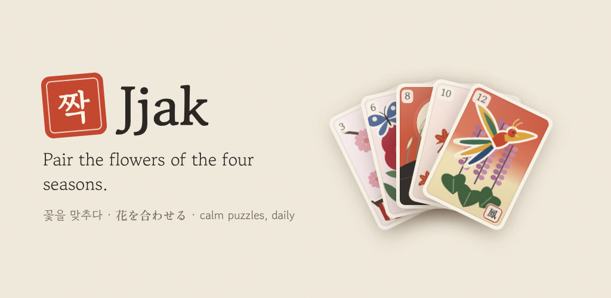
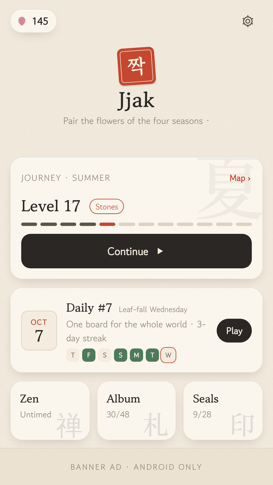
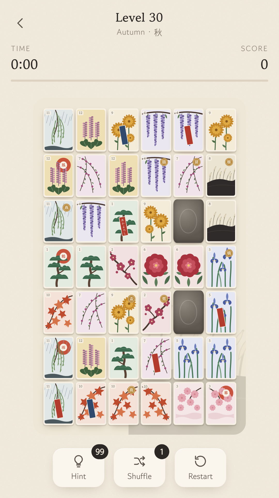
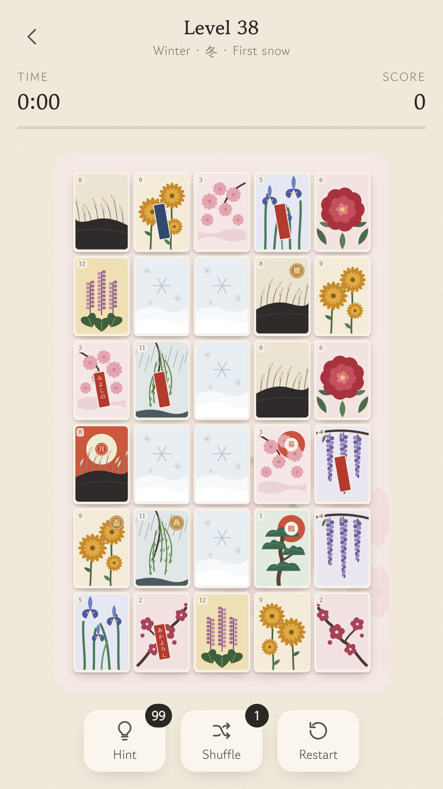
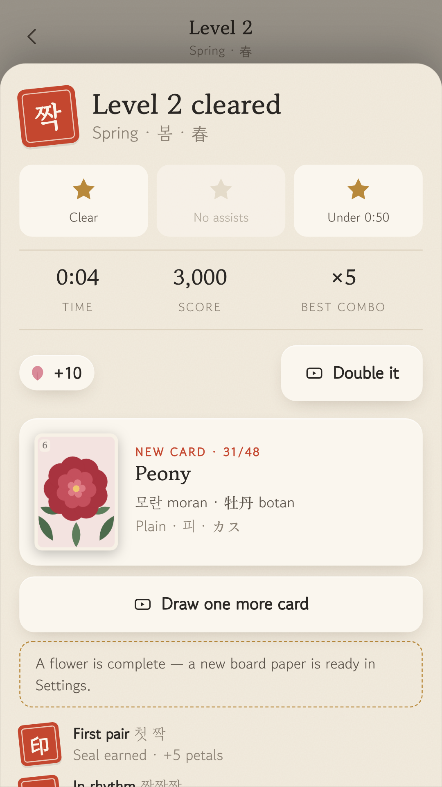
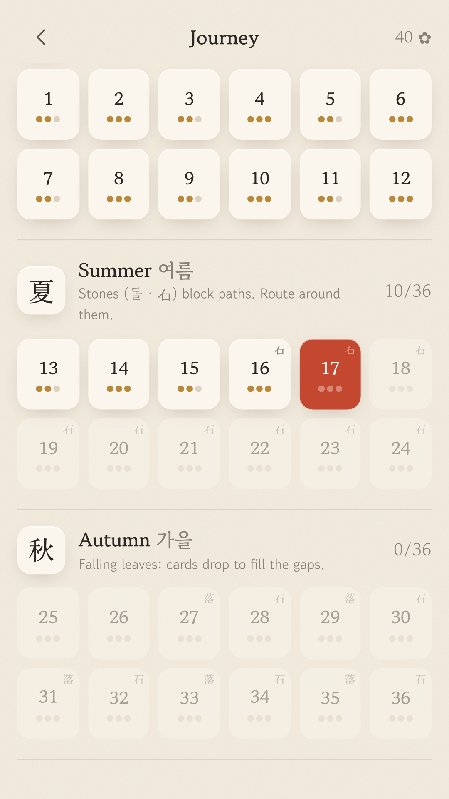
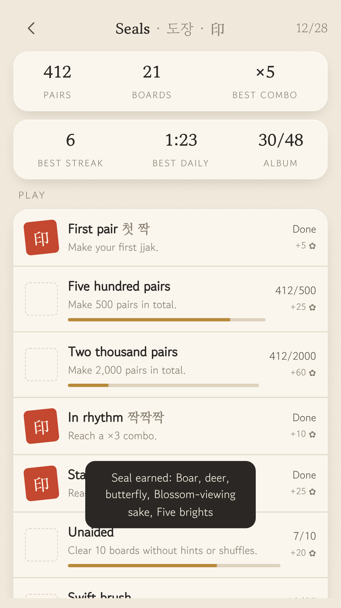
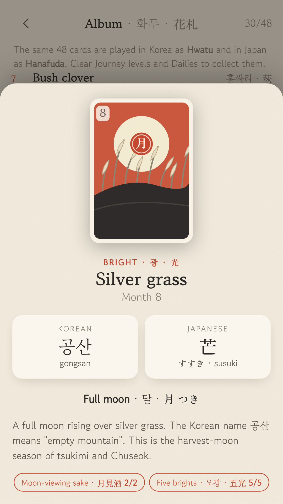
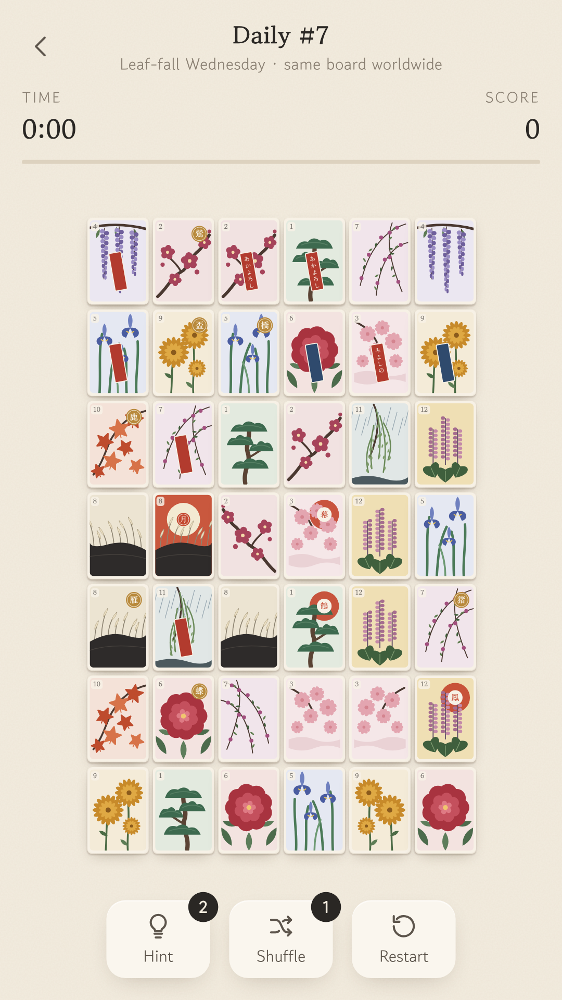

<p align="center"></p>

# Jjak (짝)

**A calm pair-connecting puzzle built on the 48-card flower deck Korea (Hwatu 화투) and
Japan (Hanafuda 花札) share.** Match flowers, chain combos (짝짝짝), clear the seasons,
and collect every card with its Korean and Japanese name.



| Home | Falling leaves | First snow | Result |
|---|---|---|---|
|  |  |  |  |

| Journey map | Seals | Card detail | Daily |
|---|---|---|---|
|  |  |  |  |

## What's inside

| | |
|---|---|
| **Modes** | Journey (4 seasonal chapters, endless, with a level map), Daily Jjak (same board worldwide, weekday themes, streak, share), Zen (untimed), Album (48 collectible cards) |
| **Mechanics** | Stones (Summer), Falling leaves (Autumn), First snow (Winter), mixed from Year 2 |
| **Meta** | 28 Seals (achievements, incl. real Go-Stop / Koi-Koi card sets), 12 unlockable board papers, lifetime stats |
| **Engine** | Shisen-sho path rule (≤ 2 turns, edge routing), boards that are **solvable by construction**, deterministic seeds, auto-reshuffle on dead ends |
| **Monetization** | AdMob rewarded / interstitial / banner under a fair-ads policy, Google UMP consent, ads capped at PG content (13+ audience) |
| **Tech** | TypeScript + Vite (no UI framework) + Capacitor 8 (Android target SDK 36, min SDK 24) |
| **Art & sound** | Original SVG cards drawn in code, OFL fonts subset to the glyphs used, WebAudio-synthesized sound |

## Docs

* [`docs/RESEARCH.md`](docs/RESEARCH.md): the 2026 puzzle market, what players like and hate, and why this concept
* [`docs/GAME_DESIGN.md`](docs/GAME_DESIGN.md): loops, level curve, economy, ad rules, art direction
* [`docs/PLAY_STORE_RELEASE.md`](docs/PLAY_STORE_RELEASE.md): **step-by-step publishing checklist** (AdMob IDs, signing, Play Console answers, listing copy)
* [`docs/CLAUDE_BUILD_PROMPT.md`](docs/CLAUDE_BUILD_PROMPT.md): the prompt for Claude to plan, rebuild, or extend the game
* [`docs/privacy-policy.html`](docs/privacy-policy.html): privacy policy ready for GitHub Pages

## Develop

```bash
npm install
npm run dev          # http://localhost:5173 — plays in any browser (ads are stubbed)
npm test             # 24 engine tests: path finding, 1,000-board solvability fuzz, gravity/snow, 120-level play-through, daily themes
npm run typecheck
```

Helpers (with `npm run dev` running): `npm run screens` (screenshots of every screen),
`npm run brand` (icon/splash sources), `node scripts/render-feature.mjs` (feature
graphic), `npm run fonts` (re-subset fonts after adding Korean/Japanese text),
`npm run assets` (Android icons/splash).

## Build for Android

```bash
npm run android:sync                     # typecheck, build web, cap sync
cd android && ./gradlew assembleDebug    # or open the folder in Android Studio
```

Every push runs **.github/workflows/android.yml**: tests → web build → `cap sync` →
debug APK + release AAB uploaded as workflow artifacts. Release signing switches on
automatically when the keystore secrets exist (see the release doc).

## Before you publish

1. Replace the **test ad IDs** in `src/config.ts` and `android/app/src/main/res/values/strings.xml`.
2. Pick your permanent **applicationId** (`capacitor.config.ts`, currently `com.jjak.puzzle`).
3. Create an upload keystore, host the privacy policy, and follow
   [`docs/PLAY_STORE_RELEASE.md`](docs/PLAY_STORE_RELEASE.md).

## Project layout

```
src/
  engine/     pure game logic: board, path finder, generator, levels, session (unit-tested)
  data/       the 48-card deck with KR/JP names and culture notes
  art/        SVG card renderer + sprite
  services/   ads (AdMob + UMP), storage, audio, haptics, progress/economy, share
  ui/         screens (welcome, home, game, album, settings), modal sheets, router
  styles/     design tokens (Paper / Ink themes), subset fonts
android/      Capacitor Android project (signing, AdMob app id, icons)
resources/    icon & splash sources → `npm run assets`
store/        Play listing graphics
```

## Credits

Card artwork is original and drawn in code. It is inspired by the traditional Hwatu and
Hanafuda deck, whose designs are centuries old, and contains no third-party trademarks.
Fonts: Gowun Batang, Gowun Dodum (Yeonghun Lim) and Zen Old Mincho (Yoshimichi Ohira),
all under the SIL Open Font License 1.1.
